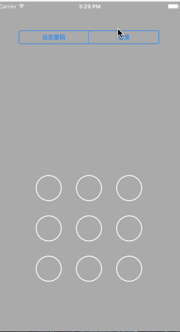

# GesturePassworeView

## Instructions
>This is a Gestures password Demo,Implements a simple set password and login validation functions.

## Show
All result is show in code



## MainClass

- **GestureButton**
>Gestures password button class, Independent unit gesture password button

- **GestureView**
>Gestures password view, Based on the UI changes of the gesture

## Integration

### First
>If you want to use gestures to password, you will only need to drag two core classes into your project and include the header file
```objectivec
#import "GestureView.h"
```


### Second
>To achieve the following code
```objectivec
@interface ViewController ()<GestureViewDelegate>
view = [[GestureView alloc] initWithFrame:CGRectMake((CGRectGetWidth(self.view.frame) - 300)/2., CGRectGetHeight(self.view.frame) - 380, 300, 300)];
view.delegate = self;
view.isSingleNode = NO;
view.isVerify = YES;
[self.view addSubview:view];
/**
 *  回调代理方法
 *  {resCode:0000,message:"验证成功"}
 *  resCode 0000 -- 成功
 *                 0001 -- 两次密码不一致
 *                 0002 -- 密码错误
 */
- (void)gestureResult:(NSMutableDictionary *)resultDic
{
    NSLog(@" vc -- %@",resultDic);
}
```

### Third
>You are success!!! So easy........
